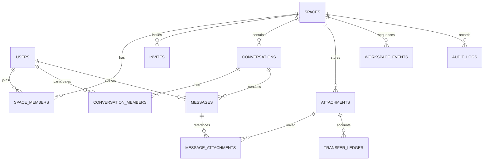

# Workspace Data Model Design

## 1. Purpose

This document defines the persistent data model for DualLane shared spaces.

External product name: **共享空间 / 空间**

Internal engineering name: `Workspace`

The model supports a productized IM space: login, invite-only membership,
conversation lists, group configuration, structured messages, first-class
files, transfer quota, realtime replay, retention, and operation records.

Compatibility with prototype Workspace data is not required. The first full
Workspace loop may replace the prototype schema directly.

## 2. Modeling Principles

- Shared-space data is server-retained by design.
- P2P private direct message and file content must never be stored in Workspace
  tables.
- Every Workspace domain table includes `space_id` unless it is truly global.
- Membership and visibility are modeled explicitly; the UI should not infer
  access from hidden rows.
- Soft state is preferred for access history: use `removed_at`, `revoked_at`,
  `failed_at`, or `deleted_at` instead of hard deleting rows that explain
  messages, files, events, or operation records.
- Operation records are durable database evidence, not normal member product
  data.
- Attachments are first-class records and may exist without messages.
- Event replay uses a monotonic per-space sequence.

## 3. Entity Map



The actual implementation can use SQLite tables and JSON columns, but the
relationships above should remain stable.

## 4. ID And Time Conventions

Recommended ID prefixes:

| Entity | Prefix |
| --- | --- |
| User | `usr_` |
| Space | `spc_` |
| Space member | `spm_` |
| Invite | `inv_` |
| Session | `ses_` |
| Conversation | `conv_` |
| Message | `msg_` |
| Attachment | `att_` |
| Upload | `upl_` |
| Transfer ledger | `trn_` |
| Event | `evt_` |
| Operation record | `aud_` |

Rules:

- Timestamps are stored as UTC ISO strings or an equivalent sortable database
  format.
- Server time is authoritative for quota day windows, retention, expiry, and
  event ordering.
- Client-provided timestamps can be kept only as metadata and must not drive
  permission, retention, or quota decisions.

## 5. Core Tables

### users

Stores GitHub-bound accounts and future bot accounts.

Fields:

| Field | Notes |
| --- | --- |
| `id` | Primary key. |
| `github_id` | Stable provider ID, nullable until seeded owner first login. |
| `github_login` | Display and owner bootstrap matching. |
| `email` | Used for seeded owner matching when available. |
| `display_name` | Product display name. |
| `avatar_url` | Optional avatar. |
| `kind` | `human` or future `bot`. |
| `created_at` | Server timestamp. |
| `last_login_at` | Updated on successful login. |

Constraints:

- Unique `github_id` when not null.
- Normalize GitHub login for case-insensitive lookup.

Seed:

- `timeStarry` / `timestarry@qq.com` is inserted as first owner candidate.
- On first matching GitHub login, bind `github_id`.
- Never replace a non-null `github_id` through login or email matching. A
  mismatched provider ID is an authentication conflict, not a profile update.

### spaces

MVP uses one default space, but schema supports multiple spaces later.

Fields:

| Field | Notes |
| --- | --- |
| `id` | `spc_default` in MVP. |
| `name` | User-facing name, default `默认空间`. |
| `slug` | Stable human-safe slug, default `default`. |
| `created_by` | User ID of creator/seed owner. |
| `created_at` | Server timestamp. |
| `updated_at` | Server timestamp. |
| `status` | `active`, future `archived`. |

### space_members

Represents membership and role in a space.

Fields:

| Field | Notes |
| --- | --- |
| `id` | Primary key. |
| `space_id` | Space reference. |
| `user_id` | User reference. |
| `role` | `owner`, `admin`, `member`, `auditor`. |
| `status` | `active`, `removed`. |
| `invited_by` | User who invited this member, nullable for seeded owner. |
| `joined_at` | Membership start. |
| `removed_at` | Membership end. |
| `created_at` | Row creation. |
| `updated_at` | Row update. |

Constraints:

- One active membership per `(space_id, user_id)`.
- At least one active owner must remain.

Product projection:

- Normal members see friendly role labels, not permission internals.

### invites

Stores invite policy and usage.

Fields:

| Field | Notes |
| --- | --- |
| `id` | Primary key. |
| `space_id` | Space scope. |
| `code_hash` | Hash of invite code. |
| `default_role` | Role granted on accept. |
| `max_uses` | Null or integer. |
| `uses` | Count of successful accepts. |
| `expires_at` | Optional expiry. |
| `created_by` | Creator user ID. |
| `created_at` | Server timestamp. |
| `revoked_at` | Optional revoke time. |

States:

| State | Condition |
| --- | --- |
| `active` | Not revoked, not expired, uses below max. |
| `used_up` | Uses reached max. |
| `expired` | `expires_at` is in the past. |
| `revoked` | `revoked_at` set. |

Rules:

- Raw invite code is returned only at creation time.
- Invite acceptance is transactional with membership creation.

### sessions

Stores browser login sessions.

Fields:

| Field | Notes |
| --- | --- |
| `id` | Primary key or hashed session token ID. |
| `user_id` | User reference. |
| `created_at` | Creation time. |
| `last_seen_at` | Optional activity time. |
| `expires_at` | Expiry. |
| `revoked_at` | Logout or forced revoke. |
| `user_agent_hash` | Optional internal diagnostic value. |

Rules:

- Session secrets are never stored in plaintext.
- Normal APIs never return session internals.

### conversations

Stores direct and group conversations.

Fields:

| Field | Notes |
| --- | --- |
| `id` | Primary key. |
| `space_id` | Space scope. |
| `type` | `direct` or `group`. |
| `title` | Required for groups, nullable for direct. |
| `created_by` | Creator user ID. |
| `created_at` | Server timestamp. |
| `updated_at` | Metadata update time. |
| `last_message_id` | Latest retained message. |
| `last_activity_at` | Sort timestamp. |
| `retention_count` | Default `10000`. |
| `status` | `active`, future `archived` or `removed`. |

Direct uniqueness:

- Store deterministic direct pair keys or enforce one direct conversation per
  member pair per space through a helper table/index.
- A repeated direct creation returns the existing conversation.

### conversation_members

Stores conversation-level access.

Fields:

| Field | Notes |
| --- | --- |
| `id` | Primary key. |
| `space_id` | Denormalized for filtering. |
| `conversation_id` | Conversation reference. |
| `user_id` | Member reference. |
| `role` | Reserved, default `member`. |
| `added_by` | User who added member. |
| `joined_at` | Access start. |
| `removed_at` | Access end. |
| `last_read_message_id` | P1 unread support. |
| `last_read_seq` | P1/P2 event/read support. |
| `notification_level` | P1/P2, `all`, `mentions`, `muted`. |

Rules:

- Active row required for reading conversation messages and conversation-visible
  files.
- Removed members lose access immediately.
- Previous membership rows remain for authorship and operation records.

### messages

Stores structured server-retained messages.

Fields:

| Field | Notes |
| --- | --- |
| `id` | Primary key. |
| `space_id` | Space scope. |
| `conversation_id` | Conversation reference. |
| `author_id` | User or bot author. |
| `author_kind` | `human`, `bot`, or `system`. |
| `kind` | `user`, `bot`, `system`. |
| `client_message_id` | Idempotency key for human/bot commands. |
| `content_format` | Current value: `duallane.message+json;v=1`. |
| `content_json` | Validated blocks. |
| `plain_text` | Server-generated or verified summary. |
| `reply_to_message_id` | Optional reply reference. |
| `created_at` | Server timestamp. |
| `edited_at` | Reserved. |
| `deleted_at` | Reserved. |

Constraints:

- Unique `(space_id, conversation_id, author_id, client_message_id)` when
  `client_message_id` is not null.
- `plain_text` is required for list previews and fallback rendering.

Retention:

- Default latest `10000` messages per conversation.
- Operation records and attachments are not deleted by message retention.

### message_attachments

Links messages to attachments.

Fields:

| Field | Notes |
| --- | --- |
| `message_id` | Message reference. |
| `attachment_id` | Attachment reference. |
| `created_at` | Link time. |

Rules:

- A message can reference multiple attachments.
- An attachment can exist without any message link.

### attachments

Stores file metadata and storage reference.

Fields:

| Field | Notes |
| --- | --- |
| `id` | Primary key. |
| `space_id` | Space scope. |
| `uploader_id` | User who uploaded. |
| `file_name` | Safe display name. |
| `mime_type` | Declared/detected type. |
| `byte_size` | Stored size. |
| `sha256` | Optional content hash. |
| `storage_key` | Internal storage key, never returned to normal clients. |
| `visibility` | `private_staging`, `conversation`, `space`. |
| `conversation_id` | Required for conversation visibility. |
| `status` | `pending`, `available`, `failed`, `removed`. |
| `created_at` | Reservation time. |
| `available_at` | Upload completion. |
| `failed_at` | Failure time. |
| `removed_at` | Removal time. |

Rules:

- `available` required for normal download.
- `private_staging` is uploader-visible during upload.
- Conversation-visible files require active conversation membership.
- Space-visible files require active space membership.

### transfer_ledger

Accounts upload and download quota.

Fields:

| Field | Notes |
| --- | --- |
| `id` | Primary key. |
| `space_id` | Space scope. |
| `user_id` | Accounted user. |
| `attachment_id` | File reference when known. |
| `direction` | `upload` or `download`. |
| `byte_size` | Reserved/accounted bytes. |
| `status` | `reserved`, `completed`, `released`, `failed`, `rejected`. |
| `reason` | Rejection/failure reason. |
| `created_at` | Creation time. |
| `completed_at` | Completion time. |
| `released_at` | Release time. |

Quota counting:

- `reserved` and `completed` count toward used quota.
- `released`, `failed`, and `rejected` do not count.

Concurrency rule:

- Reservation and remaining-quota calculation must run transactionally so
  concurrent transfers cannot exceed the daily limit.

### workspace_events

Stores replayable realtime events.

Fields:

| Field | Notes |
| --- | --- |
| `id` | Primary key. |
| `space_id` | Space scope. |
| `seq` | Monotonic per space. |
| `type` | Event type. |
| `actor_user_id` | Actor, nullable for system events. |
| `conversation_id` | Optional conversation scope. |
| `target_type` | Product object type. |
| `target_id` | Product object ID. |
| `payload_json` | Permission-filterable payload. |
| `created_at` | Event time. |

Constraints:

- Unique `(space_id, seq)`.
- Events are committed with the state change where possible.

Projection:

- Server filters events per viewer before delivery.
- Payloads should contain product-safe objects or IDs that the client can
  refetch.

### audit_logs

Stores operation records.

Fields:

| Field | Notes |
| --- | --- |
| `id` | Primary key. |
| `space_id` | Space scope when applicable. |
| `actor_user_id` | Actor or null for unauthenticated attempts. |
| `actor_github_login` | Snapshot when useful. |
| `action` | Stable action name. |
| `target_type` | Target object type. |
| `target_id` | Target ID. |
| `result` | `success`, `failure`, `rejected`. |
| `reason` | Stable reason code. |
| `ip_address` | Internal operation field. |
| `user_agent` | Internal operation field. |
| `request_id` | Internal correlation field. |
| `created_at` | Timestamp. |

Rules:

- Not returned to normal members in P0.
- Owner/admin operation-record UI is deferred.
- Fastify log redaction must not be weakened.

## 6. State Machines

### Invite

```text
active -> accepted
active -> expired
active -> revoked
active -> used_up
```

Rejected acceptance attempts write operation records.

### Membership

```text
seeded_owner -> active
invited -> active
active -> removed
removed -> active
```

Reactivation is allowed only through an explicit invite or owner/admin action.

### Conversation

```text
active -> archived
active -> removed
```

P0 uses `active`. Archive/remove is reserved.

### Attachment

```text
pending/private_staging -> available/conversation
pending/private_staging -> available/space
pending/private_staging -> failed
available -> removed
```

### Transfer Ledger

```text
reserved -> completed
reserved -> released
reserved -> failed
rejected
```

`rejected` is terminal and never consumes quota.

### Message

```text
created -> edited
created -> deleted
```

P0 only creates messages. Edit/delete fields are reserved.

## 7. Indexes And Query Paths

Recommended indexes:

- `users(github_id)`
- `users(lower(github_login))`
- `space_members(space_id, user_id, status)`
- `invites(space_id, code_hash)`
- `conversations(space_id, last_activity_at)`
- `conversation_members(conversation_id, user_id, removed_at)`
- `messages(conversation_id, created_at)`
- `messages(space_id, conversation_id, author_id, client_message_id)`
- `attachments(space_id, visibility, status, created_at)`
- `attachments(conversation_id, status, created_at)`
- `transfer_ledger(space_id, user_id, created_at, status)`
- `workspace_events(space_id, seq)`
- `audit_logs(space_id, created_at)`

P0 can use simple SQLite indexes. The important point is to keep permission
filters on indexed fields before rendering product views.

## 8. Retention And Cleanup

Message retention:

- Default latest `10000` messages per conversation.
- Retention can soft-delete old messages or remove them according to
  implementation needs.
- Message retention does not delete operation records.
- Message retention does not hard-delete standalone attachments by default.

Upload cleanup:

- Failed upload calls release quota immediately.
- Stale `pending` uploads need a cleanup job later.
- Cleanup should mark attachment `failed` and transfer `released` or `failed`
  without consuming quota.

Invite cleanup:

- Expired/revoked invites remain as records.
- Invite list UI can hide inactive invites by default in P1.

Event retention:

- P0 can keep events indefinitely.
- If event retention is added later, clients whose cursor is too old receive
  `sync.required` and refetch product state.

Operation-record retention:

- Permanent in self-hosted MVP unless a later setting is added.

## 9. Data Boundaries

Never store in Workspace domain tables:

- P2P plaintext messages.
- P2P file content or file metadata beyond safe signaling room metadata.
- P2P invite `#k=` fragments.
- OAuth provider tokens in member/product responses.

Never expose to normal member APIs:

- `storage_key`.
- Transfer ledger rows.
- Audit log rows.
- Request IDs.
- IP addresses.
- User agents.
- Raw event sequence internals.
- SQL or stack traces.

Allowed normal-member projections:

- Friendly role label.
- Remaining quota.
- Retention copy.
- Visible conversations.
- Visible members.
- Visible files.
- Structured messages from joined conversations.

## 10. Product Projection Rules

The backend should expose product-shaped view models instead of raw rows.

Examples:

- Conversation row includes `displayTitle`, `memberCount`,
  `lastMessagePlainText`, and object-scoped capabilities.
- Member row includes `displayName`, `githubLogin`, `roleLabel`, and allowed
  actions.
- File row includes `fileName`, `byteSize`, `uploader`, `visibility`, `status`,
  and `canDownload`.
- Bootstrap includes quota display fields but not ledger rows.

This keeps the client simple and prevents each UI surface from inventing its
own access logic.

## 11. Migration Guidance

Because Workspace is not launched, the implementation may replace the prototype
schema directly.

Rules:

- Do not create compatibility code for old `messages.body TEXT` Workspace
  prototypes.
- Replace with structured message fields.
- Keep P2P signaling tables and Workspace message/file tables separated.
- Add focused tests for schema-backed behavior: owner seed, invite acceptance,
  direct uniqueness, message idempotency, quota ledger, attachment independence,
  event sequence, and operation-record writes.

## 12. Acceptance Checklist

- Schema contains explicit `space_id` scope for Workspace domain rows.
- Seeded owner can bind GitHub numeric ID after first login.
- Invite codes are stored hashed.
- Direct conversations are unique per pair per space.
- Group membership changes preserve history while enforcing immediate access
  loss for removed members.
- Messages use structured content and idempotency fields.
- Attachments can exist without messages.
- Transfer ledger prevents concurrent quota bypass.
- Failed uploads release quota.
- Workspace events have monotonic per-space `seq`.
- Operation records are persisted but not exposed in normal member projections.
- P2P plaintext content and invite fragments are not stored in Workspace tables.
